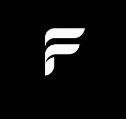

  

<h1 align="center">Fusion Snippet</h1>

  Code snippets for <strong>Fusion Framework</strong> developers in Visual Studio Code.

## Supported languages

This extension is planned to ship snippets for three languages:

| Language   | Status      |
| ---------- | ----------- |
| TypeScript | Coming soon |
| Python     | Coming soon |
| C#         | Coming soon |

Snippet prefixes and bodies are not ready yet. Once they ship, you will be able to trigger them from the editor like any other VS Code snippet.

## Current status

For the latest progress and release updates, check:

**[fusion.cipherunit.xyz](https://fusion.cipherunit.xyz)**

## Requirements

- Visual Studio Code `1.85.0` or newer

## Links

- Website: [cipherunit.xyz](https://cipherunit.xyz)
- Fusion: [fusion.cipherunit.xyz](https://fusion.cipherunit.xyz)
- Issues: [github.com/cipherunits/fusion-snippet/issues](https://github.com/cipherunits/fusion-snippet/issues)

## License

MIT
